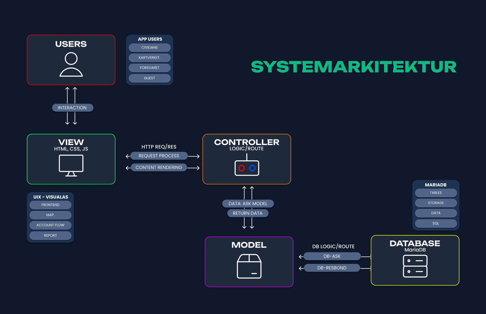

# Dokumentasjon

## Drift

Docker Desktop må være installert og åpent. Start appen med:

```bash
docker compose up --build
```

Åpne `http://localhost:8080`. Docker starter både webappen og en MySQL-database, og tabellene lages automatisk fra `Data/sql/`.

- Stoppe appen: `docker compose down`
- Nullstille databasen: `docker compose down -v`, deretter `docker compose up --build`

## Systemarkitektur

Appen er bygget med ASP.NET Core MVC. Viewene (HTML, CSS, JS) sender forespørsler til controllerne, og controllerne bruker modellene til å lese og lagre data i databasen.



- `FormController`: skjemaet for å tilby en ressurs, i tre steg: tegne på kartet, fylle ut detaljer og oppsummering. Ved innsending lagres alt i databasen, og brukeren får en kvittering.
- `ResourcesController`: viser alle innsendinger fra databasen.
- `AccountController`: registrering av bruker. Passordet lagres som hash. Innlogging er ikke ferdig.
- `ErrorController`: feilside.

**Database:** MySQL 8.4 med tabellene `Users` og `Submissions`, brukt via Entity Framework Core.

**Kart:** Leaflet og Leaflet-Geoman brukes til å tegne område eller nål. Det som tegnes lagres som punkter (JSON) og vises igjen på kvitteringssiden.

## Testing

### Automatiske tester (xUnit)

Kjøres med `dotnet test azir-sempro.Tests`.

| Testklasse | Hva den sjekker | Resultat |
|---|---|---|
| `AccountViewModelTests` | Registreringsskjemaet godtar gyldig data og avviser ugyldig e-post, kort passord og tomt fornavn | |
| `FormViewModelTests` | Standardverdiene i skjemamodellen | |

### Manuelle tester

| Scenario | Forventet | Resultat |
|---|---|---|
| Fylle ut hele skjemaet og sende inn | Kvittering med riktig tittel og kart | |
| Gå videre fra steg 2 uten tittel eller kategori | Feilmelding, blir på siden | Nettleseren viser «Fyll ut dette feltet», skjemaet sendes ikke. Bestått. |
| Åpne `/Resources` etter innsending | Innsendingen vises i listen | |
| Registrere ny bruker | Bruker lagres, sendes til innlogging | Bruker lagres og sendes til innloggingssiden. Bestått. |
| Registrere med e-post som finnes fra før | Feilmelding | «Denne e-posten er allerede registrert.» vises, ingen ny bruker. Bestått. |

## Kilder

- https://geoman.io/docs/leaflet/modes/draw-mode
- https://kartkatalog.geonorge.no/?organization=Kartverket&type=dataset&theme=Basis+geodata&theme=Befolkning&theme=Friluftsliv&theme=Natur&theme=Samferdsel&theme=Samfunnssikkerhet&theme=Annen&theme=Kyst+og+fiskeri&offset=51&append=true
