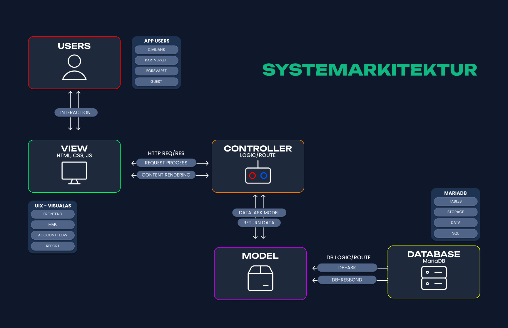
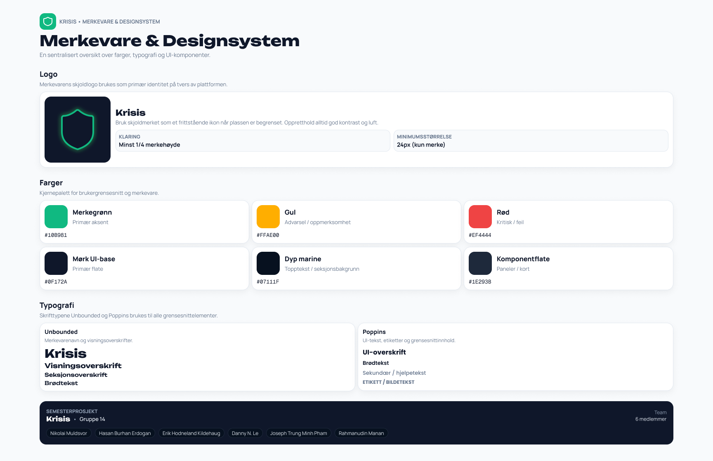
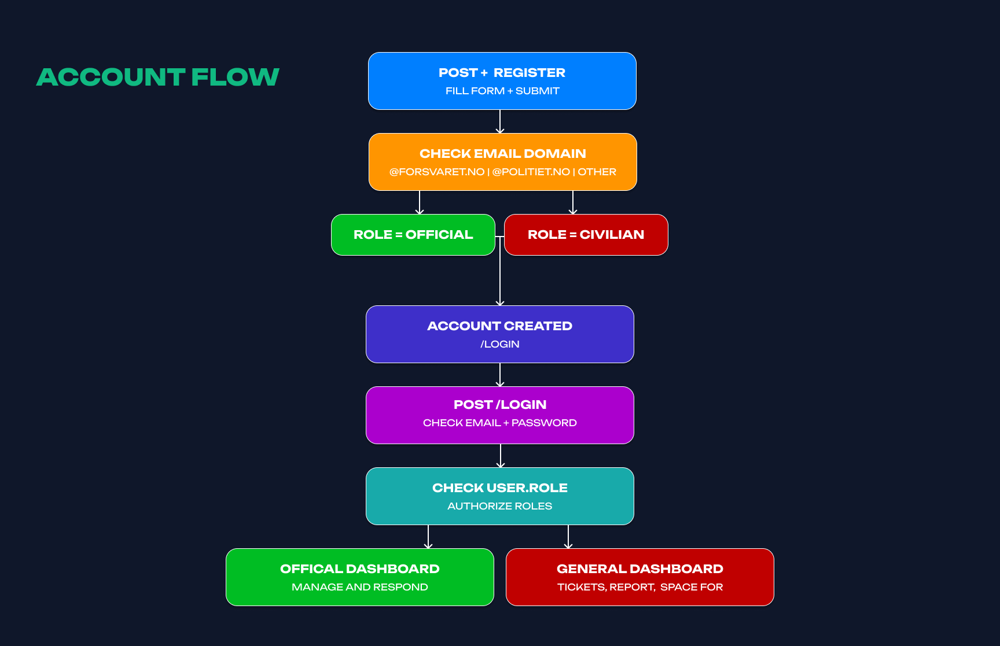

# Krisis - semester project at IT - UIA
# Gruppe 14

## Members 
- Danny Nguyen Le


## 1. For å starte applikasjonen:
For å gå inn i prosjektmappen: `cd azir-semproGH`

Bygg og start webapplikasjonen og MySQL-databasen med Docker Compose:

```bash
docker compose up --build
```

Åpne `http://localhost:8080`

Docker Compose oppretter databasen `krisisdb` og `Users`-tabellen automatisk fra `sql/users.sql`.

Stopp containerne med:

```bash
docker compose down
```

## 2. Lokal development

For å starte applikasjonen lokalt uten Docker:

```bash
dotnet run --project azir-sempro
```

Applikasjonen vil være tilgjengelig på `http://localhost:5253`


# ⚡Links
- [Github](https://github.com/dvnnyle/azir-semproGH)
- [Trello](https://trello.com/b/9TofOcKn/azir-semproTL)
- [Figma](https://www.figma.com/design/43vJYUOC0oBQ4l5ZFmEe3o/azir-semproFM?t=pe3a3mwMyu3gA6o4-1)


# Systemarkitektur og design

<table cellpadding="12" cellspacing="0">
  <tr>
    <td align="center" width="33%">
      <a href="wwwroot/assets/readme_assets/sysarkv2.png"></a><br>
      <sub>Systemarkitektur</sub>
    </td>
    <td align="center" width="33%">
      <a href="wwwroot/assets/readme_assets/brandndesign.png"></a><br>
      <sub>Brand Design</sub>
    </td>
    <td align="center" width="33%">
      <a href="wwwroot/assets/readme_assets/accountflow.png"></a><br>
      <sub>Account Flow</sub>
    </td>
  </tr>
</table>

