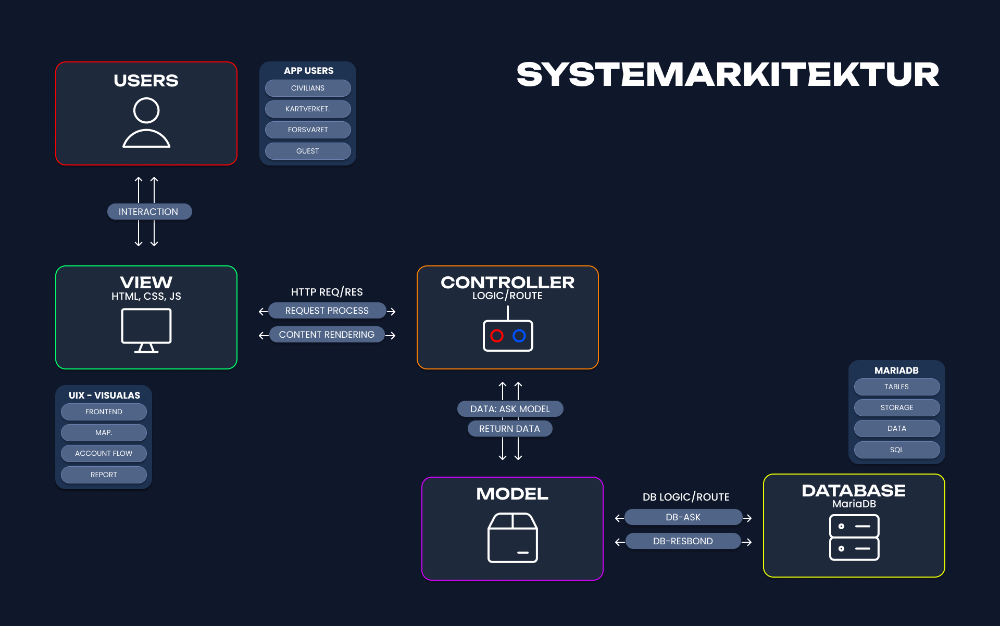

# Semester project at IT - UIA
# Gruppe 14

## Members 
- Danny Nguyen Le


## 1. For å starte applikasjonen:
For å gå inn i prosjektmappen: `cd azir-semproGH`

Bygg og start Docker Container med webapplikasjon:

```bash
docker build -t azir-sempro .
docker run -p 8080:8080 azir-sempro
```

Åpne `http://localhost:8080`

## 2. Lokal development

For å starte applikasjonen lokalt uten Docker:

```bash
dotnet run --project azir-sempro
```

Applikasjonen vil være tilgjengelig på `http://localhost:5253`


# ⚡Links
- Github: https://github.com/dvnnyle/azir-semproGH
- Trello: https://trello.com/b/9TofOcKn/azir-semproTL
- Figma: https://www.figma.com/design/43vJYUOC0oBQ4l5ZFmEe3o/azir-semproFM?t=pe3a3mwMyu3gA6o4-1


# Systemarkitektur


